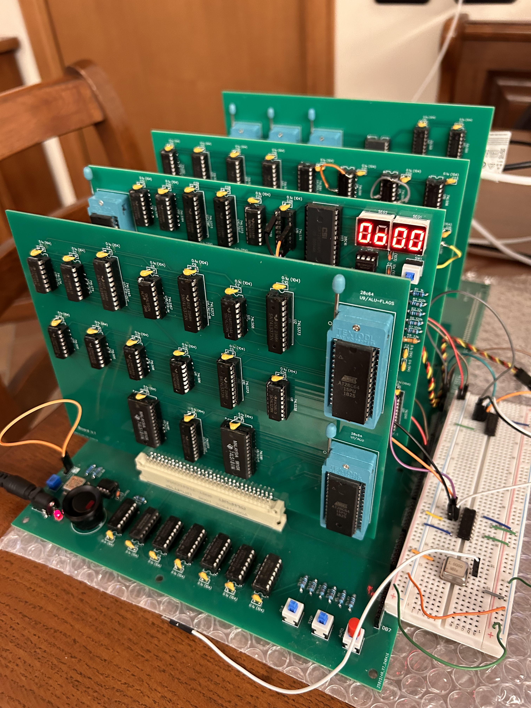

# Project Otto



Project Otto, or simply Otto, is an 8-bit TTL homebrew retro computer. I call it "homebrew" because it was designed, simulated, and assembled entirely in my apartment. "Retro" because it was built using integrated circuits typically used during the 70s/80s.

The choice that heavily influenced the development effort was not to use microprocessors from that era. Instead, I opted to create a custom CPU, building its individual components with TTL integrated circuits from the 7400 series, mostly of the LS (Low-power Schottky TTL) type.

Otto is inspired by the SAP (Simple As Possible) computer, described in the book ["Digital Computer Electronics"](https://ia803000.us.archive.org/8/items/367026792DigitalComputerElectronicsAlbertPaulMalvinoAndJeraldABrownPdf1/367026792-Digital-Computer-Electronics-Albert-Paul-Malvino-and-Jerald-A-Brown-pdf%20%281%29.pdf) by Albert Paul Malvino and Jerald A. Brown (ISBN 0-02-800594-5).

This choice allowed me to understand and experience firsthand how a single assembly instruction is executed by hardware components and gave me great freedom in terms of CPU characteristics. I still implemented an instruction set not too different from the MOS 6502, to have the ability to easily port a vast library of open source software available online.

Otto is designed as a laboratory for experimenting and having fun. This is the reason for its multiple-board layout, connected to a main board that acts as a backplane and control unit.

This layout provides the ability to modify or evolve individual parts of the system. In contrast, a single board layout, although more compact, would have forced me to redesign the entire board with every change.

The microcode needed to execute assembly instructions is stored on EEPROM. Each board hosts one or more EEPROMs if necessary.

Summarizing the technical characteristics, Otto is configured as follows:
* 8-bit TTL CPU (7400 family)
* 1 MHz clock frequency (software reducible to 250KHz)
* 1 KHz debugging clock frequency (software reducible to 250Hz)
* 6 user-accessible registers (A, X, Y, D, E, and OUT)
* 24 KB ROM
* 32 KB zero-page RAM (4 KB for stack)
* 128 KB RAM expansion (2x 64KB pages)
* 8-bit ALU (74181) and shift register
* 8-bit data bus - 24-bit address bus - 13-bit control bus
* 2x serial/USB interface
* 3x maskable interrupt lines and 10Hz timer interrupt

# Repository Contents

This repository houses the complete design files and software components for the Otto retro computer project, including PCB designs, firmware, and development tools.

## Hardware Resources

### PCB Design Files
* **easyeda/** - Complete board designs importable into EasyEDA
  * Circuit schematics
  * PCB layouts
  * Component libraries
* **gerber/** - Manufacturing-ready Gerber files for all PCBs

## Software Resources

### Core Components
* **simulation.dig** - Complete digital simulation of Otto
  * Compatible with [Digital by Helmut Neemann](https://github.com/hneemann/Digital)
  * Allows testing and verification of CPU behavior

### Development Tools
* **assembly/** - Instruction set architecture definitions
  * Compatible with [CustomASM](https://github.com/hlorenzi/customasm)
  * Defines Otto's complete instruction set
* **microcode.py** - Core microcode generation toolchain
* **7seg.py** - EEPROM content generator for 7-segment displays
* **generate-all.sh** - One-click build script for all components

### System Software
* **kernel/** - Operating system kernel source code
* **apps/** - Example applications and demos
* **roms/** - Binary files
  * Microcode EEPROMs
  * Kernel image
  * Example applications (loadable via kernel upload function)

### Documentation
* **instruction.csv** - Complete assembly instruction reference
  * Instruction formats
  * Operation descriptions
  * Addressing modes

## Getting Started

1. To build all components, run:
```bash
./generate-all.sh
```

2. For hardware manufacturing:
   * Import EasyEDA files for circuit and PCB design review
   * Use Gerber files for PCB fabrication

3. For software development:
   * Refer to the instruction set documentation
   * Use the example applications as reference
   * Build and upload applications

## Control words ROM generation
```sh
python microcode.py
```

## ROM generation
```sh
customasm kernel.asm -f intelhex -o roms/kernel-rom.hex
```

You need an EEPROM programmer for kernel and microcode.
I use [TommyPROM](https://github.com/TomNisbet/TommyPROM), an Arduino-based EEPROM programmer.

## Requirements

### Rust & customasm installation
```sh
curl --proto '=https' --tlsv1.2 -sSf https://sh.rustup.rs | sh

cargo install customasm
```

### Python library IntelHex
```sh
pip install intelhex
```

# Serial communication

I use minicom to communicate with Otto and upload files using XMODEM protocol.

```sh
ls /dev/cu*
minicom --device /dev/cu.usbserial-1433240 
minicom --device /dev/cu.usbserial-A50285BI  
```

# Credits

* porting of the ["XMODEM/CRC Receiver for the 65C02" by Daryl Rictor & Ross Archer](https://codebase64.org/doku.php?id=base:xmodem-receive)

# License

Project Otto is released under the [CC BY-NC-SA 4.0](https://creativecommons.org/licenses/by-nc-sa/4.0/) license.
You are free to share and adapt but you can not use the material for commercial purposes.
The manufacturing and sale of assembly kits, PCBs, or complete devices based on or derived from this repository is strictly prohibited. This includes, but is not limited to, direct copies, modifications, and derivative works intended for commercial purposes.
For more information please refer to the LICENSE file.